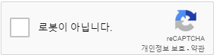
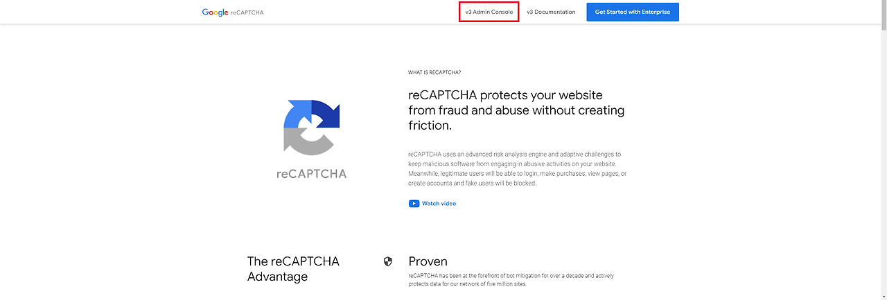
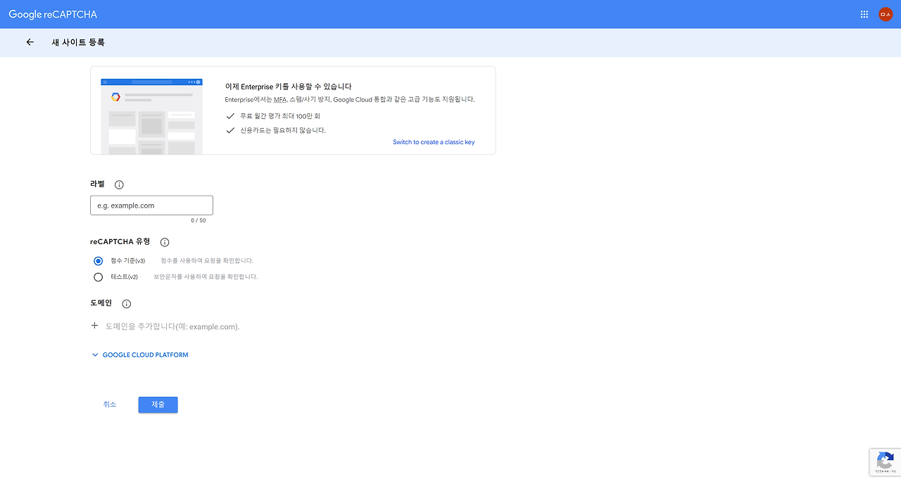
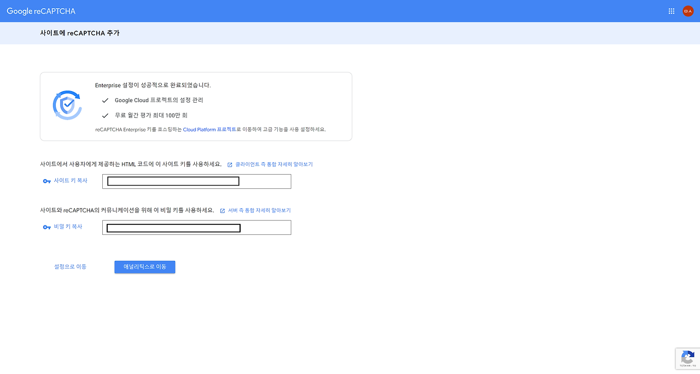
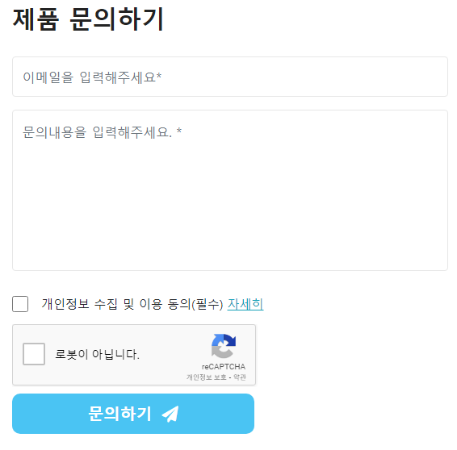

# google-reCaptcha

<br>

+ 리캡차의 가장 큰 특징 중 하나는 사용자가 단순히 "나는 로봇이 아닙니다"(I'm not a robot)란
+ 확인란을 클릭하는 것만으로도 로봇이 아님을 인증할 수 있다는 점입니다.
+ 그러나 이것만으로는 부족합니다.
+ 리캡차는 사용자에게 간단한 퍼즐이나 이미지 인식을 요청하여 인간임을 확인하고,
+ 동시에 로봇이나 자동화된 프로그램에게는 이를 우회하기 어렵게 만듭니다.
+ 리캡차는 웹사이트나 앱 개발자들에게 무료로 제공되며, 사용자들에게는 보다 안전하고 신뢰할 수 있는 온라인 환경을 제공합니다.
+ 이러한 혁신적인 보안 기술은 인터넷을 더욱 안전하고 접근하기 쉽게 만들어줍니다.
+ 따라서 리캡차는 우리가 인터넷을 자유롭게 이용할 수 있도록 도와주는 중요한 도구입니다.

<div align="center">
  
</div>
<br>

+ 최근에 회사 솔루션 소개하는 페이지에 문의하기하는곳에 리캡차 적용한 후기를 적어보았습니다.

[구글 리캡차 바로가기](https://www.google.com/recaptcha/about/)

+ 위 사이트로 접속해서 v3 Admin Console 클릭한 다음에

<div align="center">
  
</div>

+ 라벨에는 적용한 사이트를 구분하기 위한 제목같은 개념으로 적어주고
+ v2와 v3 유형은 선택하면되는데 v2는 보안문자를 입력하게 되는것이고 v3는 주제에 맞는 이미지를 고르는 유형이다.
+ 하단 도메인은 적용할 페이지의 도메인 주소를 입력하면 된다.

<div align="center">
  
</div>

+ 모두 선택하고 제출하게되면 사이트 키와 비밀 키가 주어지는 화면으로 이동하고 이제 프로젝트에서 설정해주면 된다.

<div align="center">
  
</div>

먼저 html에 reCaptcha를 적용하기 위해서는 하단 스크립트를 추가합니다.

+ onloadCallback:
  + Google reCAPTCHA API에서 호출되어 reCAPTCHA를 초기화하고 양식에 렌더링합니다.
  + 'g-recaptcha' 요소에 reCAPTCHA를 렌더링하고, 이때 필요한 정보로는 사이트 키와 verifyCallback, expiredCallback 함수가 제공됩니다.
+ verifyCallback(response):
  + 사용자가 reCAPTCHA를 성공적으로 완료하면 호출됩니다.
  + submit 버튼을 활성화하고, 버튼의 CSS 클래스를 변경하여 사용자가 양식을 제출할 수 있도록 합니다.
  + response 매개변수는 Google reCAPTCHA가 제공하는 응답 토큰입니다.
+ expiredCallback(response):
  + reCAPTCHA 응답이 만료되었을 때 호출됩니다.
  + submit 버튼을 비활성화하고, 버튼의 CSS 클래스를 변경하여 사용자가 양식을 제출할 수 없도록 합니다.
  + response 매개변수는 Google reCAPTCHA가 제공하는 응답 토큰입니다.
+ resetForm():
  + 양식을 초기 상태로 재설정합니다.
  + 이메일 주소, 문의 내용, 개인정보 수집 및 이용 동의 여부를 초기화하고, submit 버튼을 비활성화합니다.
  + 또한, Google reCAPTCHA를 다시 설정하여 사용자가 다시 확인을 해야 합니다.

```javascript
<script src="https://www.google.com/recaptcha/api.js?onload=onloadCallback&render=explicit" async defer></script>
<script>
let onloadCallback = function () {
    grecaptcha.render('g-recaptcha', {
        'sitekey': '사이트 키',
        'callback': verifyCallback,
        'expired-callback': expiredCallback,
    });
};

let verifyCallback = function (response) {
    $("#submit-btn").removeClass("disabled-btn");
    $("#submit-btn").attr("disabled", false);
};

let expiredCallback = function (response) {
    $("#submit-btn").addClass("disabled-btn");
    $("#submit-btn").attr("disabled", true);
}

let resetForm = function () {
    $("#email").val('');
    $("#content").val('');
    $("#privacy").prop("checked", false);
    $("#submit-btn").addClass("disabled-btn").attr("disabled", true);
    grecaptcha.reset();
}

window.onload = function () {
    onloadCallback();
};
</script>
```

```html
<form class="contact-form">
    <div class="col-lg-12">
        <div class="row">
            <div class="form-group">
                <input class="form-control" id="email" name="email" placeholder="이메일을 입력해주세요*" type="text">
            </div>
        </div>
    </div>
    <div class="col-lg-12">
        <div class="row">
            <div class="form-group">
                    <textarea class="form-control form-content" id="content" name="content" placeholder="문의내용을 입력해주세요. *"></textarea>
            </div>
        </div>
    </div>
    <div class="row" style="align-items: center;">
        <div class="col-1">
            <input type="checkbox" class="form-control form-checkbox" id="privacy">
        </div>
        <div class="col-11 px-1 privacy-agree-text">
                <span style="font-size: 15px;">개인정보 수집 및 이용 동의(필수) <a class="privacy-info"  data-bs-toggle="modal" data-bs-target="#privacy-modal" href="#">자세히</a></span>
        </div>
    </div>
    <div class="row">
        <div class="col" id="g-recaptcha"></div>
    </div>
    <div class="row mt-2">
        <div class="col">
            <button type="submit" name="submit" id="submit-btn" class="disabled-btn mt-0" value="문의하기" disabled>문의하기 <i class="fa fa-paper-plane"></i></button>
        </div>
    </div>
</form>
```

<div align="center">
  
</div>

+ 이제는 스프링 부트에서 reCaptcha 구성을 설정하고 위 시나리오는 페이지에서 문의하기하면 이메일로 문의 내용이 수신됩니다.

```yaml
google:
  recaptcha:
    key:
      site: 사이트 키
      secret: 비밀 키
```

+ application.yml파일에 사이트 키와 비밀 키를 설정해두고

```java
@Configuration
@PropertySource("classpath:application.yml")
public class RecaptchaConfig {

  public static final String VERIFY_URL = "https://www.google.com/recaptcha/api/siteverify";
  private final static String USER_AGENT = "Mozilla/5.0";

  @Value("${google.recaptcha.key.secret}")
  private String secret;

  public boolean verify(String gRecaptchaResponse) {
    if (gRecaptchaResponse == null || "".equals(gRecaptchaResponse)) {
      return false;
    }

    try {
      URL url = new URL(VERIFY_URL);
      HttpsURLConnection con = (HttpsURLConnection) url.openConnection();

      con.setRequestMethod("POST");
      con.setRequestProperty("User-Agent", USER_AGENT);
      con.setRequestProperty("Accept-Language", "en-US,en;q=0.5");

      String postParams = "secret=" + secret + "&response=" + gRecaptchaResponse;

      con.setDoOutput(true);
      try (DataOutputStream wr = new DataOutputStream(con.getOutputStream())) {
        wr.writeBytes(postParams);
        wr.flush();
      }

      int responseCode = con.getResponseCode();

      if (responseCode == HttpsURLConnection.HTTP_OK) {
        try (BufferedReader in = new BufferedReader(new InputStreamReader(con.getInputStream()))) {
          String inputLine;
          StringBuilder response = new StringBuilder();

          while ((inputLine = in.readLine()) != null) {
            response.append(inputLine);
          }

          JsonObject jsonObject = Json.createReader(new StringReader(response.toString())).readObject();
          return jsonObject.getBoolean("success");
        }
      } else {
        return false;
      }
    } catch (Exception e) {
      e.printStackTrace();
      return false;
    }
  }
}
```

+ reCaptcha 구성하는 클래스를 만들어 주고

```java
@Service
@RequiredArgsConstructor
public class MailService {

    private final JavaMailSender emailSender;
    private final RecaptchaConfig recaptchaConfig;

    public boolean sendEmail(InquiryDto dto) {
        try {
            boolean isVerified = recaptchaConfig.verify(dto.getRecaptcha());
            if (!isVerified) {
                return false;
            } else {
                MimeMessage mimeMessage = emailSender.createMimeMessage();
                MimeMessageHelper helper = new MimeMessageHelper(mimeMessage, true);
                helper.setFrom("example@example.com"); // 발신자 이메일
                helper.setTo("example@example.com"); // 수신자 이메일
                helper.setSubject("이메일 도착!"); // 이메일 제목
                String emailContent = "문의 내용: " + dto.getContent(); // 문의 내용
                helper.setText(emailContent);
                emailSender.send(mimeMessage);
                return true;
            }
        } catch (MessagingException | MailException e) {
            throw new RuntimeException("이메일 전송 중 오류가 발생했습니다.", e);
        }
    }
}
```

+ controller에서 넘어온 dto객체의 유효성을 확인하고 reCaptcha 인증 처리가 되었는지는 프론트에서도 한번 거치지만
+ service 레이어에서도 한번 더 검증을 거친 뒤에 이메일이 전송하게 됩니다.
