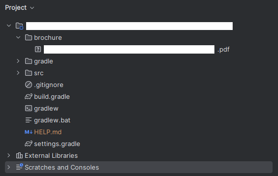
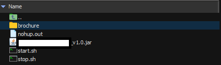
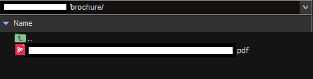

# 파일 다운로드
- - -

### 개발 환경
1. 스프링 부트 2.3.2
2. java 14
3. jQuery 1.12.4
4. bootstarp ui framework


+ 파일 다운로드 기능을 처음 구현해보면서 겪게 된 문제와 몰랐던 부분에 대해서 기록하려고 만들었습니다.
+ 회사에서 솔루션을 소개하는 랜딩 페이지를 리뉴얼하면서 겪게 된 문제를 해결한 경험을 적어보았다.
+ 제품소개서를 다운받고 페이지 내에서 문의하기 하면 영업팀 메일로 수신되게끔만 했으면 되었다.
+ 파일 다운로드하는 기능은 로컬에서 테스트할 때는 잘 되었는데 배포하니까
+ 계속해서 500 에러가 떠서 왜인지 찾다가 시간 낭비를 오래 했다
+ 파일의 경로는 프로젝트 내부 최상단 디렉터리에 위치시키고 배포하였으나 서버 디렉리에도 물리적으로 올려주었어야 했다.

<br>

+ 스프링 부트 프로젝트 내부에 있 경로에 brochure 디렉터리를 만들어서 안에 파일을 넣어주고



+ WebConfig에서도 파일 경로 설정을 미리 해주고

```java
@Configuration
public class WebConfig implements WebMvcConfigurer {
    @Override
    public void addResourceHandlers(ResourceHandlerRegistry registry){
        String separator = File.separator;
        String path = new File(".").getAbsoluteFile().toString();
        String rePath = path.replace("\\", separator).replace(".", "");
        String brochurePath = rePath + separator + "brochure" + separator;

        registry.addResourceHandler("/brochure/**")
                .addResourceLocations("file://" + brochurePath);
    }
}
```

```javascript
document.getElementById('download-btn').addEventListener('click', (e) => {
        e.preventDefault();
        let xhr = new XMLHttpRequest();
        xhr.open('GET', '/download-brochure', true);
        xhr.responseType = 'blob';

        xhr.onload = function() {
            if (xhr.status === 200) {
                let blob = new Blob([xhr.response], { type: 'application/octet-stream; charset=UTF-8' });
                let url = window.URL.createObjectURL(blob);
                let link = document.createElement('a');
                link.href = url;
                console.log(link)
                link.setAttribute('download', '파일명.pdf');
                document.body.appendChild(link);
                link.click();
                document.body.removeChild(link);
                window.URL.revokeObjectURL(url);
            }
        };

        xhr.send();
    });
```


```
Failed to read the 'responseText' property from 'XMLHttpRequest':
The value is only accessible if the object's 'responseType' is '' or 'text' (was 'blob').
```

+ 이 에러는 XMLHttpRequest 객체의 'responseType'이 'blob'으로 설정되어 있을 때

+ 'responseText' 속성을 읽을 수 없다는 것을 의미하여 'blob'으로 설정된 경우에는

+ 'responseText' 대신 'response' 속성을 사용하여 응답 데이터에 접근해야 합니다.

+ 사용했던 jQuery 버전이 1.12버전대라서 발생한 에러로 어쩔 수 없이 바닐라 JS로 요청하게 되었다.

```java
@RestController
public class FileController {

    @GetMapping("/download-brochure")
    public ResponseEntity<Resource> downloadBrochure() {

        try {
            String fileName = new File(".").getAbsoluteFile().toString() + "/brochure/파일명.pdf";
            Resource resource = new UrlResource("file:" + fileName);

            if (!resource.exists()) {
                return new ResponseEntity<>(HttpStatus.NOT_FOUND);
            }

            String encodedFileName = URLEncoder.encode(fileName, "UTF-8").replaceAll("\\+", "%20");

            HttpHeaders headers = new HttpHeaders();
            headers.add("Content-Type", "application/octet-stream; charset=UTF-8");
            headers.setContentDisposition(ContentDisposition.builder("attachment")
                    .filename(encodedFileName)
                    .build()
            );

            return ResponseEntity.ok()
                    .headers(headers)
                    .body(resource);

        } catch (UnsupportedEncodingException | MalformedURLException e) {
            return new ResponseEntity<>(HttpStatus.INTERNAL_SERVER_ERROR);
        }
    }
}
```

+ 위에 코드를 다 작성하고 나면 이제 ec2에 배포하고 나서 jar파일을 배포한 같은 경로에도 동일하게
+ brochure 디렉터리를 만들어서 소개서 pdf파일을 넣어주어야한다.





+ 해당 경로에 미리 안넣어두고 배포하니 계속 500번 에러가 뜨고 WebConfig에도 파일 경로 지정을 제대로 안해놔서 시간이 오래 걸렸었다.